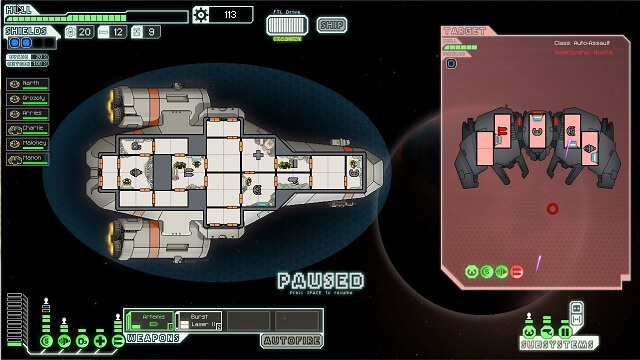

<h1>Super Space Scavengers Game Design Document</h1>
<h2>Table of Contents</h2>
<ul>
  <li><a href="#DesignDocumentHistory" name="#">1. Design Document History</a></li>
  <li><a href="#GameOverview" name="#">2. Game Overview</a>
    <ul>
      <li><a href="#Concept" name="#" >2.1 &mdash; Concept</a></li>
      <li><a href="#CoreFeatures" name="#" >2.2 &mdash; Core Features</a></li>
      <li><a href="#GameFlowSummary" name="#" >2.3 &mdash; Game Flow Summary</a></li>
      <li><a href="#Theme" name="#" >2.4 Theme</a></li>
      <li><a href="#Genre" name="#" >2.5 &mdash; Genre</a></li>
    </ul>
  </li>
  <li><a href="#Gameplay" name="#">3. Gameplay</a>
    <ul>
      <li><a href="#Progression" name="#" >3.1 &mdash; Progression</a></li>
      <li><a href="#Economy" name="#" >3.2 &mdash; Economy</a></li>
      <li><a href="#UpgradeSystem" name="#" >3.3 &mdash; Upgrade System</a></li>
      <li><a href="#Environment" name="#" >3.4 &mdash; Environment</a>
        <ul>
          <li><a href="#Layout" name="#" >3.4.1 &mdash; Layout</a></li>
          <li><a href="#PowerGrid" name="#" >3.4.2 &mdash; Power Grid</a></li>
          <li><a href="#EnvironmentalDecay" name="#" >3.4.3 &mdash; Environmental Decay</a></li>
          <li><a href="#Enemies" name="#" >3.4.4 &mdash; Enemies</a></li>
          <li><a href="#Loot" name="#" >3.4.5 &mdash; Loot</a></li>
          <li><a href="#Shops" name="#" >3.4.6 &mdash; Shops</a></li>
        </ul>
      </li>
      <li><a href="#GameplayInfluences" name="#" >3.5 &mdash; Gameplay Influences</a>
        <ul>
          <li><a href="#GI01" name="#" >3.5.1 &mdash; FTL</a></li>
          <li><a href="#GI02" name="#" >3.5.2 &mdash; Spelunky</a></li>
          <li><a href="#GI03" name="#" >3.5.3 &mdash; Pitfall Planet</a></li>
        </ul>
      </li>
    </ul>
  </li>
  <li><a href="#" name="#">4. Mechanics</a>
    <ul>
      <li><a href="#" name="#" >4.1 &mdash; Player Mechanics</a>
        <ul>
          <li><a href="#" name="#" >4.1.1 &mdash; Movement</a></li>
          <li><a href="#" name="#" >4.1.2 &mdash; Other Movement</a></li>
          <li><a href="#" name="#" >4.1.3 &mdash; Picking &amp; Dropping Objects</a></li>
          <li><a href="#" name="#" >4.1.4 &mdash; Contextual Interaction</a></li>
          <li><a href="#" name="#" >4.1.5 &mdash; Actions</a></li>
        </ul>
      </li>
      <li><a href="#" name="#" >4.2 &mdash; NPC Mechanics</a>
        <ul>
          <li><a href="#" name="#" >4.2.1 &mdash; NPC List</a></li>
          <li><a href="#" name="#" >4.2.2 &mdash; NPC States</a></li>
          <li><a href="#" name="#" >4.2.3 &mdash; NPC Actions</a></li>
          <li><a href="#" name="#" >4.2.4 &mdash; NPC Interactions</a></li>
        </ul>
      </li>
      <li><a href="#" name="#" >4.3 &mdash; Enemy Mechanics</a>
        <ul>
          <li><a href="#" name="#" >4.3.1 &mdash; Enemy List</a></li>
          <li><a href="#" name="#" >4.3.2 &mdash; Enemy States</a></li>
          <li><a href="#" name="#" >4.3.3 &mdash; Enemy Actions</a></li>
          <li><a href="#" name="#" >4.3.4 &mdash; Enemy Interactions</a></li>
        </ul>
      </li>
      <li><a href="#" name="#" >4.4 &mdash; Item Mechanics</a>
        <ul>
          <li><a href="#" name="#" >4.4.1 &mdash; Attribute Items</a></li>
          <li><a href="#" name="#" >4.4.2 &mdash; Combat Items</a></li>
          <li><a href="#" name="#" >4.4.3 &mdash; Non-Combat Items</a></li>
        </ul>
      </li>
      <li><a href="#" name="#" >4.5 &mdash;  Influences</a>
        <ul>
          <li><a href="#" name="#" >4.5.1 &mdash; Game #1</a></li>
          <li><a href="#" name="#" >4.5.2 &mdash; Game #2</a></li>
          <li><a href="#" name="#" >4.5.3 &mdash; Game #3</a></li>
        </ul>
      </li>
    </ul>
  </li>
  <li><a href="#" name="#">5. User Interface</a>
    <ul>
      <li><a href="#" name="#" >5.1 &mdash; UI Theme</a></li>
      <li><a href="#" name="#" >5.2 &mdash; Splash Screens</a></li>
      <li><a href="#" name="#" >5.3 &mdash; Main Menu</a></li>
      <li><a href="#" name="#" >5.4 &mdash; Pause Menu</a></li>
      <li><a href="#" name="#" >5.5 &mdash; In-Game UI</a>
        <ul>
          <li><a href="#" name="#" >5.5.1 &mdash; HUD</a></li>
          <li><a href="#" name="#" >5.5.2 &mdash; Action Specfic UI</a></li>
          <li><a href="#" name="#" >5.5.3 &mdash; Shop UI</a></li>
          <li><a href="#" name="#" >5.5.4 &mdash; End Round UI</a></li>
          <li><a href="#" name="#" >5.5.5 &mdash; End Game UI</a></li>
        </ul>
      </li>
      <li><a href="#" name="#" >5.6 &mdash; UI Influences</a>
        <ul>
          <li><a href="#" name="#" >5.6.1 &mdash; Game #1</a></li>
          <li><a href="#" name="#" >5.6.2 &mdash; Game #2</a></li>
          <li><a href="#" name="#" >5.6.3 &mdash; Game #3</a></li>
        </ul>
      </li>
    </ul>
  </li>
  <li><a href="#" name="#">6. Narrative</a>
    <ul>
      <li><a href="#" name="#" >6.1 &mdash; Theme Overview</a></li>
      <li><a href="#" name="#" >6.2 &mdash; Theme Mood</a></li>
      <li><a href="#" name="#" >6.3 &mdash; Back Story</a></li>
      <li><a href="#" name="#" >6.4 &mdash; Plot Elements</a>
      <li><a href="#" name="#" >6.5 &mdash; Cut Scenes/Cinematics</a></li>
      <li><a href="#" name="#" >6.6 &mdash; Game World</a>
        <ul>
          <li><a href="#" name="#" >6.6.1 &mdash; General Overview</a></li>
          <li><a href="#" name="#" >6.6.2 &mdash; Physical Characteristics</a></li>
          <li><a href="#" name="#" >6.6.3 &mdash; Example #1</a></li>
          <li><a href="#" name="#" >6.6.4 &mdash; Example #2</a></li>
          <li><a href="#" name="#" >6.6.5 &mdash; Example #3</a></li>
        </ul>
      </li>
      <li><a href="#" name="#" >6.7 &mdash; Players</a>
        <ul>
          <li><a href="#" name="#" >6.7.1 &mdash; Player #1 Personality</a></li>
          <li><a href="#" name="#" >6.7.2 &mdash; Player #1 Back Story</a></li>
          <li><a href="#" name="#" >6.7.3 &mdash; Player #2 Personality</a></li>
          <li><a href="#" name="#" >6.7.4 &mdash; Player #2 Back Story</a></li>
          <li><a href="#" name="#" >6.7.5 &mdash; Player #3 Personality</a></li>
          <li><a href="#" name="#" >6.7.6 &mdash; Player #3 Back Story</a></li>
          <li><a href="#" name="#" >6.7.7 &mdash; Player #4 Personality</a></li>
          <li><a href="#" name="#" >6.7.8 &mdash; Player #4 Back Story</a></li>
        </ul>
      </li>
      <li><a href="#" name="#" >6.8 &mdash; Narrative Influences</a>
        <ul>
          <li><a href="#" name="#" >6.8.1 &mdash; Game #1</a></li>
          <li><a href="#" name="#" >6.8.2 &mdash; Game #2</a></li>
          <li><a href="#" name="#" >6.8.3 &mdash; Game #3</a></li>
        </ul>
      </li>
    </ul>
  </li>
  <li><a href="#" name="#">7. Audio</a>
    <ul>
      <li><a href="#" name="#" >7.1 &mdash; General Overview</a></li>
      <li><a href="#" name="#" >7.2 &mdash; Mood</a></li>
      <li><a href="#" name="#" >7.3 &mdash; Music</a>
        <ul>
          <li><a href="#" name="#" >7.3.1 &mdash; Ambiet</a></li>
          <li><a href="#" name="#" >7.3.2 &mdash; Action</a></li>
          <li><a href="#" name="#" >7.3.3 &mdash; Victory</a></li>
          <li><a href="#" name="#" >7.3.4 &mdash; Defeat</a></li>
        </ul>
      </li>
      <li><a href="#" name="#" >7.4 &mdash; SFX</a>
        <ul>
          <li><a href="#" name="#" >7.4.1 &mdash; Menu SFX List</a></li>
          <li><a href="#" name="#" >7.4.2 &mdash; Player SFX List</a></li>
          <li><a href="#" name="#" >7.4.3 &mdash; NPC SFX List</a></li>
          <li><a href="#" name="#" >7.4.4 &mdash; Enemy SFX List</a></li>
          <li><a href="#" name="#" >7.4.5 &mdash; Environment SFX List</a></li>
          <li><a href="#" name="#" >7.4.6 &mdash; Item SFX List</a></li>
          <li><a href="#" name="#" >7.4.7 &mdash; Combat SFX List</a></li>
          <li><a href="#" name="#" >7.4.8 &mdash; UI SFX List</a></li>
        </ul>
      </li>
      <li><a href="#" name="#" >7.5 &mdash; Audio Influences</a>
        <ul>
          <li><a href="#" name="#" >7.5.1 &mdash; Game #1</a></li>
          <li><a href="#" name="#" >7.5.2 &mdash; Game #2</a></li>
          <li><a href="#" name="#" >7.5.3 &mdash; Game #3</a></li>
        </ul>
      </li>
    </ul>
  </li>
</ul>

<!--1. DESIGN DOCUMENT HISTORY-->
<h2 id="DesignDocumentHistory">1. Design Document History</h2>
<ul>
	<li>
		<h3>Version 0.0.1</h3>
		
Initial creation of the Design Document, mostly markdown structure. Some parts from section 1 and 2 added.

	</li>
</ul>

<!--2. GAME OVERVIEW-->
<h2 id="GameOverview">2. Game Overview</h2>
<ul>
	<li>
		<h3 id="Concept">2.1 Concept</h3>
		
<em>Super Space Scavengers</em> is a couch multiplayer computer game where players fight to strip an abandoned space ship of its most valuable parts before the ship becomes completely unstable and explodes!

	</li>
	<li>
		<h3 id="CoreFeatures">2.2 Core Features</h3>
		
<em>Super Space Scavengers</em> has the following three core features:
			<ul>
				<li>
					<strong>Simple Controls</strong>
					
<em>Super Space Scavengers</em> is a game that is easy to pick up and start playing without an overly complex control scheme.

				</li>
				<li>
					<strong>Procedurally Generated Space Ships</strong>
					
Every round features a differentely generated abandoned space ship to explore, complete with a different language and iconography so each ship feels truly alien to the player.

				</li>
				<li>
					<strong>Fast and Frantic Multiplayer</strong>
					
Each game of <em>Super Space Scavengers</em> only takes about 10 &ndash; 15 minutes and is rife with action, explosions, power failures, and many, many player deaths.

				</li>
			</ul>
		

	</li>
	<li>
		<h3 id="GameFlowSummary">2.3 Game Flow Summary</h3>
		
<em>Super Space Scavengers</em>  follows a game flow not very different from an arcade game experience:
		<code>
			[Title Screen]=>[Main Menu]=>[Player Select/Confirmation]=>[Gameplay]=>[Round Results Menu]=>[End Game]
		</code>
		

	</li>
	<li>
		<h3 id="Theme">2.4 Theme</h3>
		
<em>Super Space Scavengers</em> is set in space. As such the game has a very futuristic theme, common with most space games. Like the movie <em>Star Wars: A New Hope</em>, the setting of <em>Super Space Scavengers</em> is a very used version of space (think the Jawas on Tatooine or anywhere in Mos Eisley). The world has advanced and futuristic technology, but it's not new and pristine.

	</li>
	<li>
		<h3 id="Genre">2.5 Genre</h3>
		
<em>Super Space Scavengers</em> is designed to be a arcade-action couch multiplayer computer game experienced by up to 4 players without splitscreen.

	</li>
</ul>

<!--GAMEPLAY-->
<!--2. GAME OVERVIEW-->
<h2 id="Gameplay">3. Gameplay</h2>
<ul>
	<li>
		<h3 id="Progression">3.1 Progression</h3>
		
<em>Super Space Scavengers</em> is a couch multiplayer computer game where players fight to strip an abandoned space ship of its most valuable parts before the ship becomes completely unstable and explodes!

	</li>
	<li>
		<h3 id="Economy">3.2 Econonmy</h3>
		
<em>Super Space Scavengers</em> has the following three core features

	</li>
	<li>
		<h3 id="UpgradeSystem">3.3 Upgrade System</h3>
		
<em>Super Space Scavengers</em>  follows a game flow not very different from an arcade game experience:
		<blockquote>
			[Title Screen]=>[Main Menu]=>[Player Select/Confirmation]=>[Gameplay]=>[Round Results Menu]=>[End Game]
		</blockquote>
		

	</li>
	<li>
		<h3 id="Environment">3.4 Environment</h3>
    <h4>Concept</h4>
		
The world of <em>Super Space Scavengers</em> is that of a used universe. While space travel and furturistic technology exists, it is not always bright, clean, and new technology. The world is scrappy and more wild west-like, with space ships being held together with the equivilent of duct tape and a prayer. Good parts are hard to come by and maintaining what you got is the difference between death and survival. Think of this universe as being a lot like the space ships and scavenged together contraptions found in Mos Eisley in the <em>Star Wars</em> universe.

      

         
        <caption>A scavenged and hastily put together jawa sandcrawler.</caption>
          
      

    <h4>Implementation</h4>
    
This style can be acheived by ensuring that spaceships have a lack of "perfection" to them. Asymetrical design in ship layout and imperfect shapes used in the making of rooms and hallways can help establish that these ships are scrapped together. This style can also be acheived by taking a symetrical design, destroying it slightly, and then "repairing" it in a style that doesn't match the ship quite right. From an art standpoint we can make sure to not use bright, clean whites or metals entirely. Instead, burn marks, scratches, and bolted on rushed repair jobs can make things look just barely held together and not perfect.

    

         
        <caption>The metal on this spaceship has scorch marks and is asymetrical in design.</caption>
          
      

		<ul>
			<li>
				<strong  id="Layout">3.4.1 Layout</strong>
        <h4>Concept</h4>
				
The layout of spaceships in <em>Super Space Scavengers</em> need to both fit the theme of the game as well as be intuitive as if it were a real ship that could be piloted if it were not abandonned. The layout of ships should take inspiration from other space games or space movies. Large, purposed rooms, like the bridge or engineering room, connected with hallways or turbo lifts will make up the bulk of spaceship layout. A good example of this kind of layout exists in the indie game <em>Monaco</em>. There are clearly defined rooms and hallways that connect the rooms together. While <em>Monaco</em> does not use procedural content generation, or have the correct camera angle that we will be using, it is a good example of the type of space ship layout we should try for.

        

         
        <caption>Notice the room layout and connected pathways in <em>Monaco</em>.</caption>
          
      

        <h4>Implementation</h4>
        
Creating the layout of the spaceship will be a three part process by the PCG (Procedural Content Generation) system. The first step for the PCG is to create the perfect layout of the ship based on prefabricated rooms that we design ahead of time. Next, the PCG will attempt to create hallways or paths to these rooms. Most times this will succeed with one or more connecting hallways/paths, but sometimes it will fail and rooms may only be accessible through other means (blowing up or cutting through a wall). The third and last step of the PCG is to destroy sections of the ship's layout in order to similuate damage to the ship. The layout of the ships will most likely be geometric in nature with basic shapes like squares and rectangles defining the shape of the rooms

			</li>
			<li>
				<strong id="PowerGrid">3.4.2 Power Grid</strong>
        <h4>Concept</h4>
				
The main inspiration behind the power grid system in <em>Super Space Scavengers</em> comes from redstone usage in the game <em>Minecraft</em> and power usage in <em>FTL</em>. Like in <em>Minecraft</em>, there are power conduits running through the abandoned space ships that provide power to the doors and other systems throughout the ship. When these lines are broken, power ceases to flow creating some sort of effect appropriate to losing power like in <em>FTL</em>.

        

         
        <caption>Redstone circuits that are both powered and unpowered in <em>Minecraft</em>.</caption>
          
         
        <caption>Power being shifted from the shield in order to use weapons in <em>FTL</em>.</caption>
          
        

        <h4>Implementation</h4>
        
I imagine that I will have to do a lot of research into how the power grid system is created and works in general. I imagine that generating the power grid will probably have to be a part of the PCG that does the initial layout of the ship. The types of power grid objects that will need to be layed out ahead of time with layout generation will most likely be:
        <ul>
          <li>
            <strong>Power Generators</strong>
            
Power Generators produce power on a large level and will most likely be located in engineering rooms. Without an active Power Generator the ship's sytems have to run on limited-duration use batteries. Even on batteries not all systems will be able to run without an active Power Generator. These types of power grid objects are extremely valuable but if removed or damaged can cause massive power failures on a space ship.

          </li>
          <li>
            <strong>Batteries</strong>
            
Batteries act as a backup to Power Generators if the main power on a ship is not active. Batteries can come in three sizes, small, medium, and large quantities which determine how much power they provide and for how long. Batteries can be worth quite if scavenged, but can also be used to power sections of a ship for a limited time. A stretch goal for batteries involve making sure the right type of battery is used otherwise brownouts or power surges can occur.

          </li>
          <li>
            <strong>Power Conduits</strong>
            
Power conduits allow power to travel throughout the ship to all the different rooms and systems. Not necessarily fragile, Power Conduits can be either exposed or hidden in walls in the game. Breaking a conduit will most likely cause power failures to a section of a space ship.

          </li>
        </ul>

			</li>
			<li>
				<strong id="EnvironmentalDecay">3.4.3 Environmental Decay</strong>
        <h4>Concept</h4>
				
Much like how batteries only supply so much power for so long, integrity of the abandoned spaceship hulls in <em>Super Space Scavengers</em> will only last so long in each round of the game. The idea behind environmental decay acts as both round limiter (so players can not stick around forever) and as a random element of surprise that will make areas of the ship more dangerous than others. It is unclear right now how exactly this will affect gameplay but I am leaning towards it sucking the player towards the hole in an attempt to eject the player out of the spaceship and into space. This, however, might be too extreme so it may simply act as an impassible tile/block.

			</li>
			<li>
				<strong id="Enemies">3.4.4 Enemies</strong>
				
<em>Super Space Scavengers</em> is a game mostly about trying to risk how long you can survive in a challenging environment so actual enemy AI might be a little too much for this type of game. However, if a spaceship had an <em>Alien</em> theme to it I can see an "agent of chaos"-like enemy roaming the ship and chasing players down working well. Enemies right now are not high on the list of things this game needs yet, but if it does this area will be updated accordingly.

			</li>
			<li>
				<strong id="Loot">3.4.5 Loot</strong>
				
Loot exists aplenty in <em>Super Space Scavengers</em>. Loot can exist as technology aboard ships, such as fancy computer chips that power bridge operations, power grid objects, such as batteries or power generators, or simply valuables that look shiny and expensive. What exactly is worth more than the others in up to the players to find out as evey ship is meant to be "foreign" each round.

			</li>
			<li>
				<strong id="Shops">3.4.6 Shops</strong>
				
As zany as it sounds, sometimes there are shops aboard <em>Super Space Scavengers</em>. Considering these abandoned ships are on their last legs, the shops aboard these sails are having amazing sales and EVERYTHING MUST GO! Shops are meant to allow players to upgrade things like health, movement speed, buy tools/weapons, and maybe even get secrets. Shops should be rare and highly contested points of interest on a ship. Everything that is in a shop is only available on a first come, first buy basis. Players can attempt to steal from the shop keeper, a la <em>Spelunky</em>, but if they do then they will have to face the wrath of an angry shop keeper aboard the already dangerous ship.

        

         
        <caption>Shops allow the player to buy upgrades and items, but don't anger the shopkeeper.</caption>
          
        

			</li>
		</ul>
	</li>
	<li>
		<h3 id="GameplayInfluences">3.5 Gameplay Influences</h3>
		
<em>Super Space Scavengers</em> is highly influenced by rougelikes, such as <em>Spelunky</em>, and <em>FTL</em>. The idea of creating a PCG system and setting it in space comes from a lot of time playing both of these games and wanting to expand upon the boarding mechanics in <em>FTL</em>. Also a big influence is the game <em>Pitfall Planet</em>. I'd like the gameplay, specifically the player camera and controls to act a lot like this game.

		<ul>
			<li>
				<strong id="GI01">3.5.1 FTL</strong> 
        

         
        <caption><em>FTL</em> plays a huge part in influences how systems on a ship and ship layout will work.</caption>
          
        

			</li>
			<li>
				<strong id="GI02">3.5.2 Spelunky</strong> 
        

         
        <caption>The PCG in <em>Spelunky</em> is remarkable and the gameplay is phenomenal.</caption>
          
        

			</li>
			<li>
				<strong id="GI03">3.5.3 Pitfall Planet</strong> 
        

         
        <caption>The gameplay of Pitfall planet, in particular the camera, controls, and art style are quite fun!</caption>
          
        

			</li>
		</ul>
	</li>
</ul>
